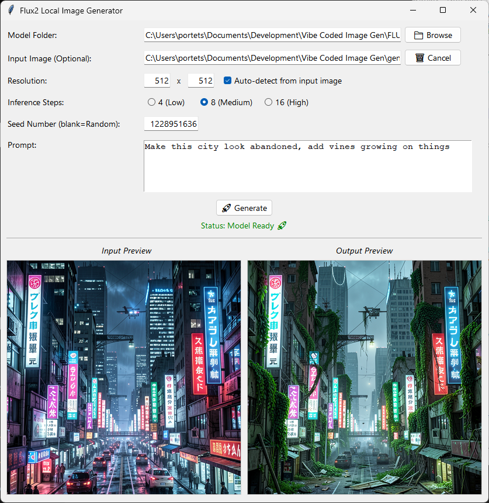

# Flux2-Image-Gen-GUI
Unofficial FLUX.2 GUI for local image gen.
Vibe coded with QWEN3.6. I made this so others and myself can quickly and easily test local image generation.

Currently tested on Windows and Ubuntu 26.04 with an RTX 4070 and 64GB RAM. FLUX.2-klein-4b generates a 512x512 image in about 4 seconds. Should work well on any machine with 32+GB RAM but will be much faster on a machine with an Nvidia 3000 series or newer, otherwise it will fall back to CPU generation which is slow but useable.

 

# Usage
Clone FLUX.2-klein-4B into the same folder as ImageGenGUI.py
```
git clone https://huggingface.co/black-forest-labs/FLUX.2-klein-4B
```
Note: FLUX.2-klein-9B also works but requires huggingface login and runs much slower.

Install CUDA 13+ if you have an Nvidia GPU.\

On Windows:\
add the CUDA PATH for CUDA_HOME, the CUDA installer only fills the PATH for CUDA_PATH.\
Use the correct PyTorch install command for your machine from this page: https://pytorch.org/get-started/locally/
Then:
```
pip install diffusers transformers accelerate
```

On Linux(Ubuntu/Debian based distros):
```
apt install python3-tk
python -m venv .venv
source .venv/bin/activate
pip install diffusers transformers accelerate
```
Linux with CUDA:
```
pip install torch torchvision
```
Linux without CUDA:
```
pip install torch torchvision --index-url https://download.pytorch.org/whl/cpu
```

Then it's as simple as running:
```
python ImageGenGUI.py
```

# Current features
- Automatic FLUX.2-klein-4b model loading if found in the same folder, can select other FLUX.2 models
- Inference step adjustment
- Manual or automatic random seed
- Input image for reference or editing with automatic resolution matching
- Automaticically add increment to output filename to prevent overwriting

# To-Do
- Add cpu offload switch and warning if output resolution too high and vram too low
- Add detection for Flux2-klein-base models and modify inference_step values + add guidance_scale modifier
